# Semiconductor Manufacturing Fault Detection

> 반도체 제조 공정 센서 데이터 기반 **불량 예측 · 임계값 최적화 · 센서 원인 후보 해석** 프로젝트  
> FDC-style fail risk screening with imbalanced process sensor data


---

## At A Glance

| Item | Summary |
|---|---|
| Dataset | UCI SECOM semiconductor manufacturing sensor data |
| Task | Pass/Fail prediction from 590 anonymized process sensor variables |
| Problem Type | Imbalanced binary classification + fault detection thresholding |
| Best Model | ExtraTrees with validation-based threshold optimization |
| Key Metric | Fail Recall / F2 / PR-AUC, not plain Accuracy |
| Best Test Result | Fail Recall **0.7619**, Fail F2 **0.4819** |
| Baseline Check | All-pass baseline reaches **0.9331 accuracy** but **0.0000 fail recall** |
| Main Output | Data quality profile, model comparison, threshold artifacts, interpretability reports |

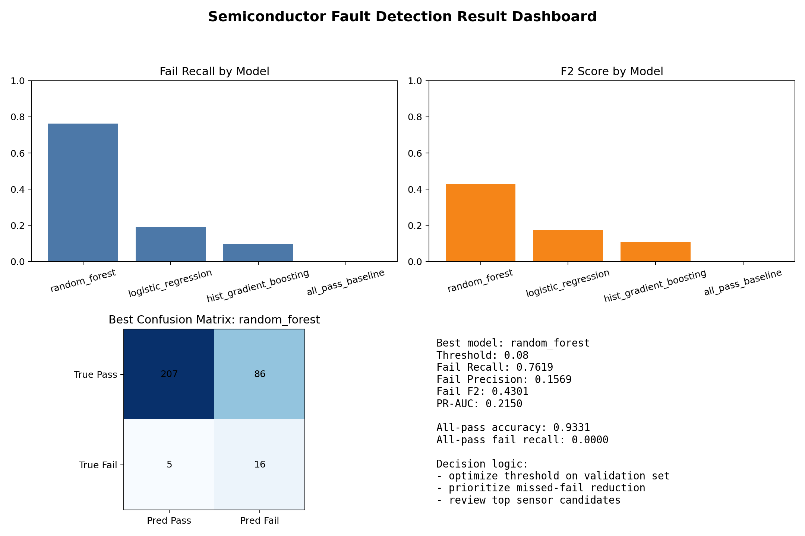

---

## Why I Built This

반도체 제조 데이터는 일반적인 예제 데이터처럼 깨끗하지 않습니다. 센서 결측치가 많고, 불량 샘플은 정상 샘플에 비해 매우 적습니다. 이런 상황에서 Accuracy만 보면 모델이 대부분을 정상으로 예측해도 좋아 보일 수 있습니다.

이 프로젝트는 그 문제를 피하기 위해 아래 흐름으로 진행했습니다.

1. 공정 센서 데이터의 결측/불균형/저분산/중복 센서 구조를 먼저 확인한다.
2. `all_pass_baseline`을 추가해 Accuracy가 왜 위험한지 수치로 확인한다.
3. 모델을 여러 개 비교하되, Accuracy보다 불량 미탐을 줄이는 Recall/F2를 본다.
4. 임계값은 test set이 아니라 validation set에서 먼저 결정한다.
5. 최종 test set에서 성능을 확인한다.
6. built-in importance와 permutation importance로 주요 센서 후보를 정리한다.

이 프로젝트의 초점은 모델 성능 과장이 아니라, 제조 센서 데이터에서 결측, 불균형, 임계값 선택, 불량 미탐 비용, 센서 후보 해석을 일관된 분석 흐름으로 다루는 것입니다.

---

## Tech Stack

| Layer | Tools |
|---|---|
| Language | Python |
| Data | pandas, NumPy |
| ML | scikit-learn, Logistic Regression, RandomForest, ExtraTrees, HistGradientBoosting |
| Evaluation | Precision, Recall, F1, F2, PR-AUC, confusion matrix |
| Visualization | matplotlib |
| Reproducibility | raw-data downloader, deterministic split, generated reports |

---

## Semiconductor Manufacturing Context

이 프로젝트는 익명화된 SECOM 센서 데이터를 사용하므로 특정 공정명을 직접 매핑할 수는 없습니다. 대신 반도체 전공정에서 자주 언급되는 5개 공정 관점으로, 센서 데이터가 어떤 문제와 연결되는지 정리했습니다.

| Process | What Happens | Data / AI View |
|---|---|---|
| Photo | 회로 패턴을 웨이퍼에 전사 | CD, overlay, 노광 조건, 패턴 불량 |
| Etch | 불필요한 막을 제거해 패턴 형성 | 식각률, 균일도, endpoint, chamber 상태 |
| Diffusion | 이온주입/열처리로 전기적 특성 형성 | 온도, 시간, 농도, recipe 안정성 |
| Thin Film | CVD/PVD/ALD로 박막 형성 | 막 두께, 균일도, gas/pressure |
| CMP/Cleaning | 평탄화 및 오염 제거 | particle, scratch, slurry, 세정 조건 |

핵심은 공정명을 외우는 것이 아니라, **공정 조건 - 센서 신호 - 품질/수율 결과**를 데이터 문제로 바꾸는 것입니다.

---

## Dataset

| Property | Value |
|---|---:|
| Samples | 1,567 |
| Sensor Features | 590 |
| Pass Samples | 1,463 |
| Fail Samples | 104 |
| Fail Ratio | 6.64% |
| Zero-Variance Sensors | 116 |
| Sensors with >=50% Missing Values | 28 |
| Highly Correlated Sensor Pairs >=0.98 | 201 |

Raw data is not committed. It is downloaded reproducibly through `src/fetch_data.py`.

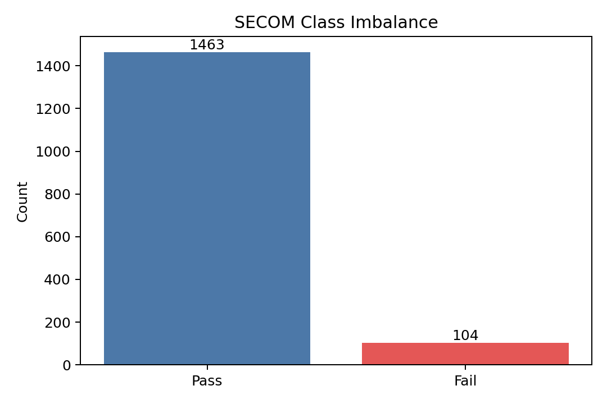

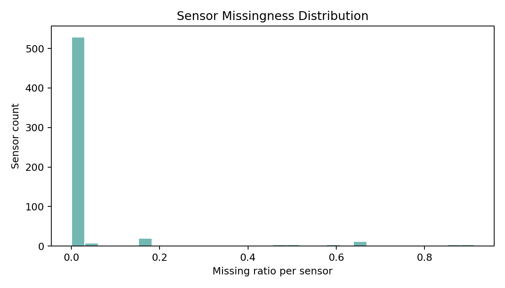

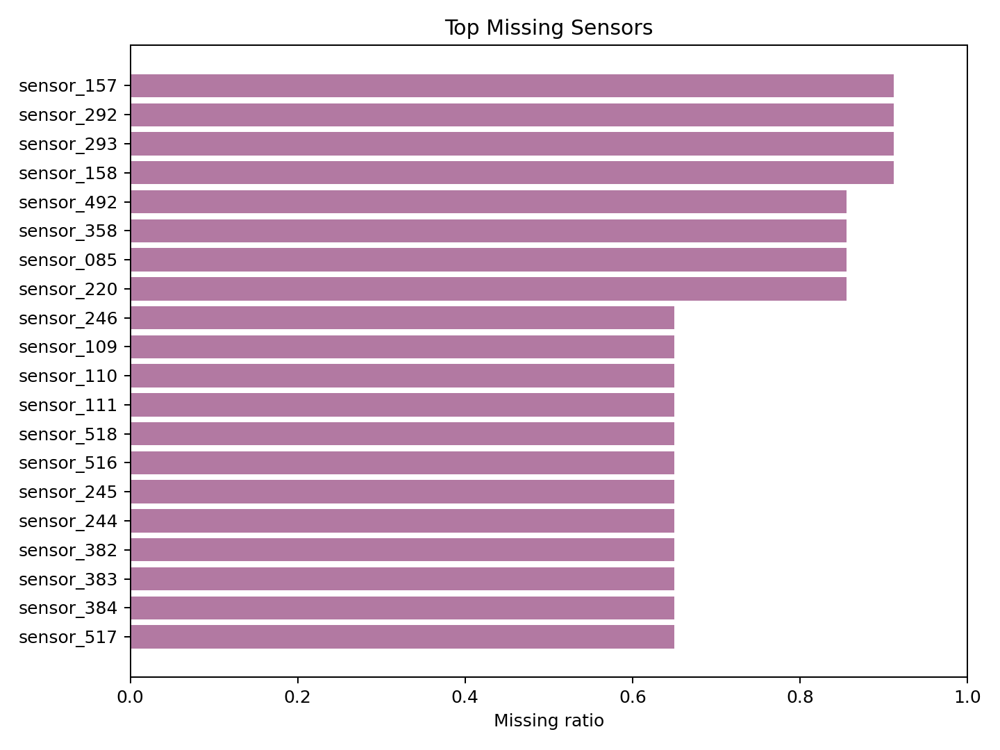

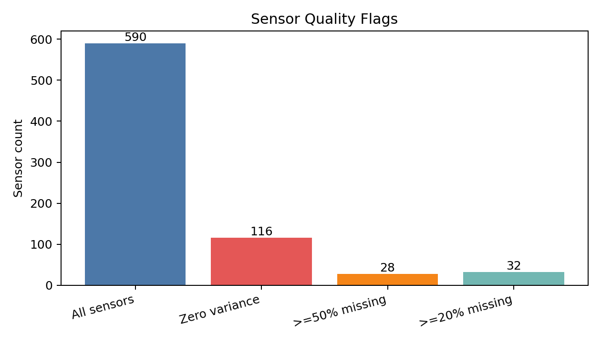

The EDA intentionally separates modeling from data-quality diagnosis:

- `reports/missing_profile.csv` ranks sensors by missing count and missing ratio.
- `reports/sensor_quality_profile.csv` flags zero-variance and all-missing sensors.
- `reports/high_correlation_pairs.csv` lists highly redundant sensor pairs.
- `reports/split_class_profile.csv` confirms the train/validation/test splits keep the fail ratio stable.

---

## Pipeline

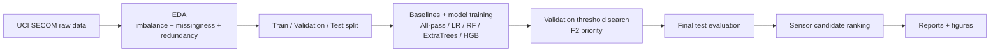

### Evaluation Design

The decision threshold is selected on the **validation set** using F2 score, then evaluated once on the **test set**. This avoids selecting the threshold directly on the test set.

Why F2?

- In manufacturing fault detection, missed failures can be more expensive than extra inspection.
- F2 gives more weight to Recall than Precision.
- This fits early-warning systems such as FDC, equipment monitoring, and yield risk screening.

Why not Accuracy?

- The test set has 293 pass samples and 21 fail samples.
- A rule that predicts every wafer as pass reaches **0.9331 accuracy**.
- That same rule catches **0 out of 21 fail cases**, so fail recall is **0.0000**.
- For a manufacturing decision-support PoC, this is unacceptable because missed failures are the exact risk the system is supposed to surface.

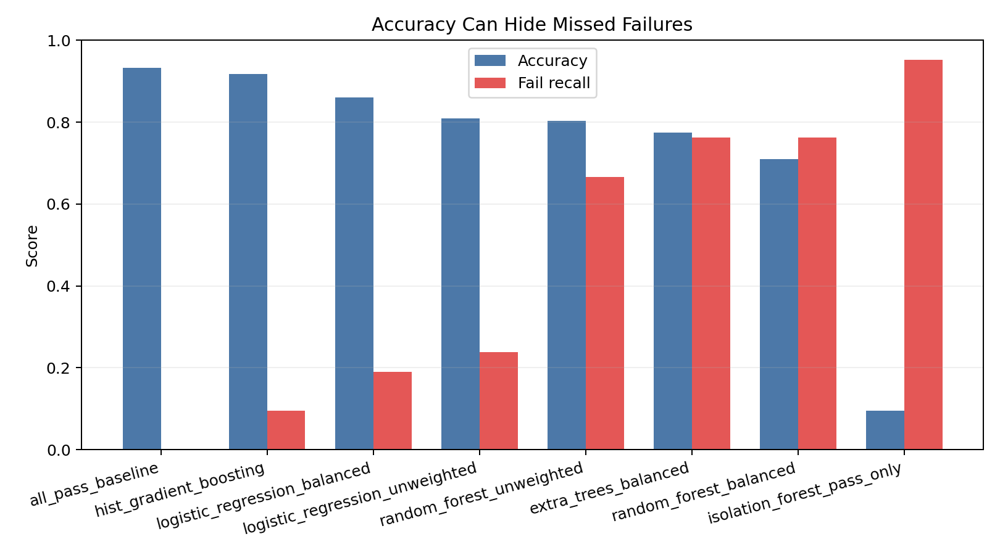

---

## Results

| Model | Threshold | Accuracy | Fail Recall | Fail Precision | Fail F2 | PR-AUC | Missed Fail | False Alarm |
|---|---:|---:|---:|---:|---:|---:|---:|---:|
| ExtraTrees balanced | 0.10 | 0.7739 | **0.7619** | 0.1951 | **0.4819** | **0.2174** | **5** | 66 |
| RandomForest unweighted | 0.10 | 0.8025 | 0.6667 | 0.2029 | 0.4575 | 0.1701 | 7 | 55 |
| RandomForest balanced | 0.08 | 0.7102 | **0.7619** | 0.1569 | 0.4301 | 0.2150 | **5** | 86 |
| Logistic Regression unweighted | 0.06 | 0.8089 | 0.2381 | 0.1020 | 0.1880 | 0.1220 | 16 | 44 |
| Logistic Regression balanced | 0.62 | 0.8599 | 0.1905 | 0.1290 | 0.1739 | 0.1219 | 17 | 27 |
| HistGradientBoosting | 0.02 | 0.9172 | 0.0952 | 0.2222 | 0.1075 | 0.2137 | 19 | 7 |
| All-pass baseline | 1.00 | **0.9331** | 0.0000 | 0.0000 | 0.0000 | 0.0669 | 21 | **0** |

### Confusion Matrix

| | Pred Pass | Pred Fail |
|---|---:|---:|
| True Pass | 227 | 66 |
| True Fail | 5 | 16 |

Interpretation:

- The selected threshold intentionally increases false alarms to reduce missed failures.
- ExtraTrees kept the same test fail recall as the balanced RandomForest while reducing false alarms from 86 to 66.
- This is reasonable for an early-warning manufacturing use case where missed failures are more costly than extra inspection.
- This model is not claimed as production-ready. The value is in the full problem-solving flow: imbalance recognition, threshold design, metric selection, and sensor candidate ranking.

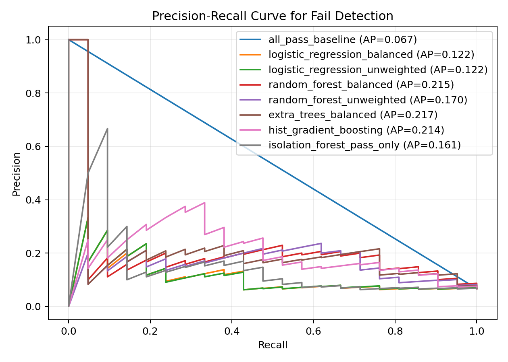

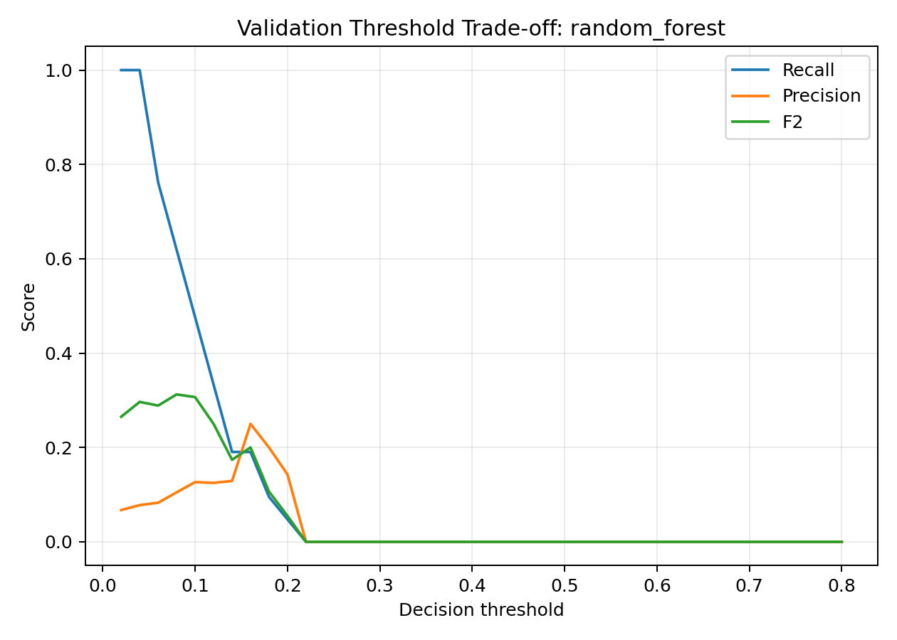

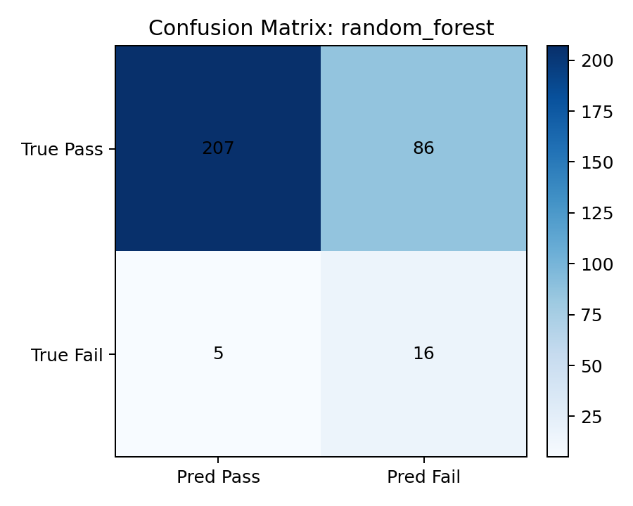

---

## Sensor Candidate Interpretation

Top built-in feature importance candidates from the best model:

| Rank | Sensor | Importance |
|---:|---|---:|
| 1 | sensor_129 | 0.009227 |
| 2 | sensor_511 | 0.008027 |
| 3 | sensor_064 | 0.007861 |
| 4 | sensor_059 | 0.006802 |
| 5 | sensor_065 | 0.006011 |
| 6 | sensor_103 | 0.005898 |
| 7 | sensor_028 | 0.005651 |
| 8 | sensor_122 | 0.004884 |
| 9 | sensor_130 | 0.004874 |
| 10 | sensor_452 | 0.004635 |

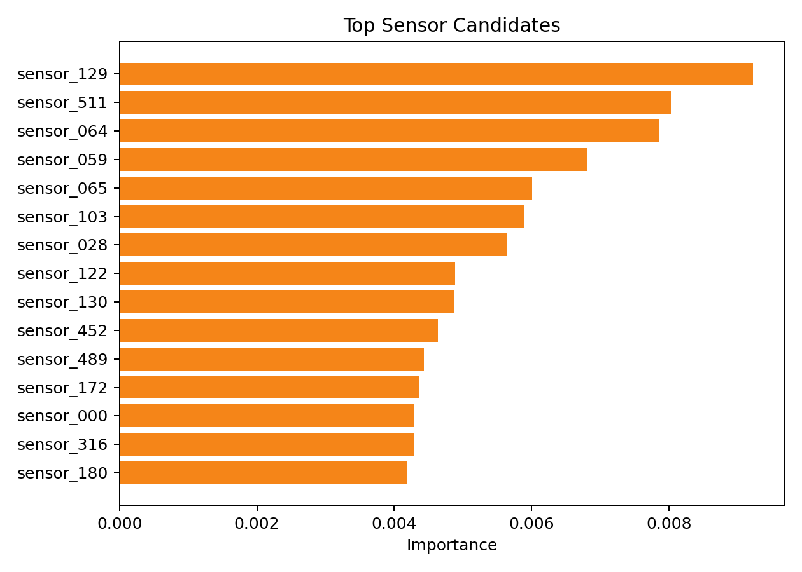

Top validation permutation importance candidates:

| Rank | Sensor | Mean AP Drop |
|---:|---|---:|
| 1 | sensor_064 | 0.023783 |
| 2 | sensor_065 | 0.012138 |
| 3 | sensor_037 | 0.009045 |
| 4 | sensor_028 | 0.005910 |
| 5 | sensor_419 | 0.005770 |
| 6 | sensor_076 | 0.005670 |
| 7 | sensor_210 | 0.005547 |
| 8 | sensor_031 | 0.005145 |
| 9 | sensor_295 | 0.004913 |
| 10 | sensor_125 | 0.004687 |

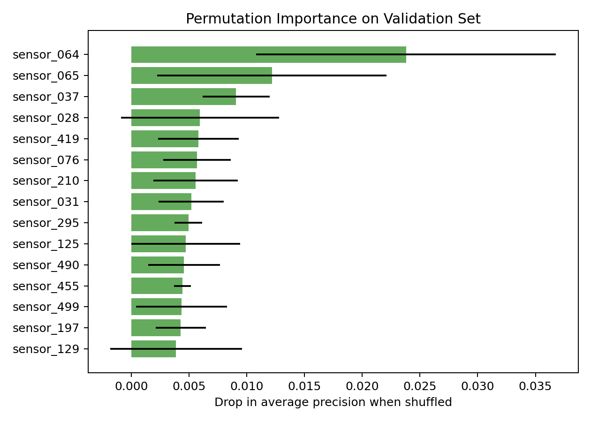

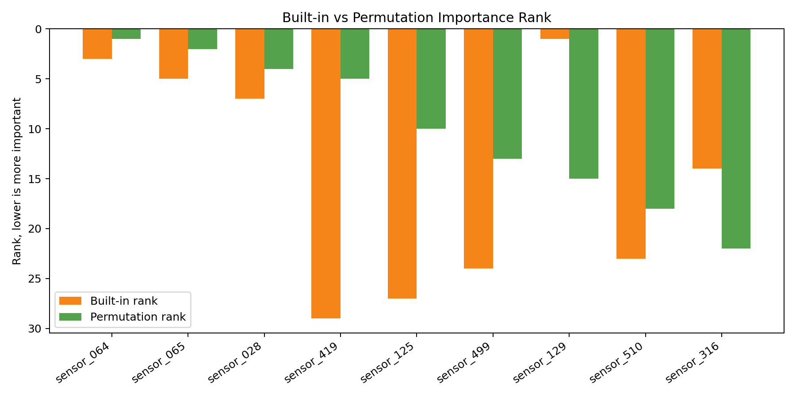

Because SECOM anonymizes sensors, the interpretation is framed as **sensor candidate prioritization** rather than direct physical root-cause naming. In a real fab environment, these candidates would be mapped back to process/equipment tags for process or equipment engineer review.

Built-in tree importance and permutation importance are intentionally reported together:

- Built-in importance shows which sensors the fitted ensemble used often when splitting.
- Permutation importance checks whether validation PR-AUC drops when a sensor is shuffled.
- Overlapping candidates such as `sensor_064`, `sensor_065`, and `sensor_028` are stronger review candidates than a single ranking alone.

---

## How To Run

```bash
python -m venv .venv
source .venv/bin/activate
pip install -r requirements.txt

python src/fetch_data.py
python src/train.py
```

Generated outputs:

- `reports/metrics.csv`
- `reports/model_comparison.md`
- `reports/run_summary.md`
- `reports/class_profile.csv`
- `reports/missing_profile.csv`
- `reports/sensor_quality_profile.csv`
- `reports/high_correlation_pairs.csv`
- `reports/split_class_profile.csv`
- `reports/threshold_curve_best.csv`
- `reports/top_features.csv`
- `reports/permutation_importance.csv`
- `reports/importance_comparison.csv`
- `reports/models/<model_name>/summary.csv`
- `reports/models/<model_name>/validation_threshold_curve.csv`
- `reports/models/<model_name>/test_predictions.csv`
- `reports/models/<model_name>/*.png`
- `reports/figures/*.png`
- `docs/interview_notes.md`
- `docs/upgrade_checklist.md`

---

## Repository Structure

```text
.
├── README.md
├── LICENSE
├── requirements.txt
├── docs
│   ├── interview_notes.md
│   └── upgrade_checklist.md
├── src
│   ├── fetch_data.py
│   └── train.py
└── reports
    ├── class_profile.csv
    ├── high_correlation_pairs.csv
    ├── importance_comparison.csv
    ├── metrics.csv
    ├── model_comparison.md
    ├── missing_profile.csv
    ├── models
    │   └── <model_name>
    │       ├── confusion_matrix.png
    │       ├── precision_recall_curve.png
    │       ├── summary.csv
    │       ├── test_predictions.csv
    │       ├── threshold_tradeoff.png
    │       └── validation_threshold_curve.csv
    ├── run_summary.md
    ├── permutation_importance.csv
    ├── sensor_quality_profile.csv
    ├── split_class_profile.csv
    ├── top_features.csv
    ├── threshold_curve_best.csv
    └── figures
        ├── accuracy_warning.png
        ├── result_dashboard.png
        ├── class_imbalance.png
        ├── missingness_distribution.png
        ├── sensor_quality_summary.png
        ├── top_missing_sensors.png
        ├── precision_recall_curve.png
        ├── threshold_tradeoff.png
        ├── confusion_matrix_best.png
        ├── feature_importance.png
        ├── importance_comparison.png
        └── permutation_importance.png
```

---

## Project Scope

| Focus | Evidence |
|---|---|
| Data quality | imbalance, missingness, zero-variance sensors, correlated sensor pairs |
| Model comparison | all-pass baseline, Logistic Regression, RandomForest, ExtraTrees, HistGradientBoosting |
| Metric design | Fail Recall, F2, PR-AUC, missed fail count, false alarm count |
| Evaluation hygiene | validation threshold selection, final test evaluation |
| Sensor interpretation | built-in importance, permutation importance, candidate-prioritization framing |
| Reproducibility | raw data download script and generated reports |

---

## Next Improvements

- Add optional SHAP-based local/global explanations
- Add cost-sensitive thresholding with assumed inspection/failure cost
- Add anomaly detection baseline such as Isolation Forest or AutoEncoder
- Add process-tag mapping if a non-anonymized fab dataset is available
- Build a small FastAPI inference endpoint for FDC PoC
