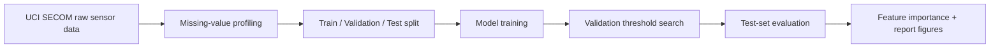

# Semiconductor Process Fault Detection

> SECOM 반도체 제조 센서 데이터 기반 **불량 예측 · 임계값 최적화 · 센서 원인 후보 해석** 프로젝트


## 1. Project Overview

반도체 제조 데이터는 일반적인 예제 데이터처럼 깨끗하지 않습니다. 센서 결측치가 많고, 불량 샘플은 정상 샘플에 비해 매우 적으며, 단순 Accuracy만 보면 모델이 대부분을 정상으로 예측해도 좋아 보일 수 있습니다.

이 프로젝트는 UCI SECOM 데이터를 활용해 아래 질문을 검증합니다.

- 결측과 불균형이 큰 반도체 제조 센서 데이터에서 불량을 어떻게 예측할 것인가?
- Accuracy가 아니라 불량 미탐을 줄이는 Recall/F2 관점으로 모델을 어떻게 평가할 것인가?
- 모델이 중요하게 본 센서 후보를 어떻게 현장 엔지니어가 이해할 수 있게 정리할 것인가?

## 2. Why This Project Matters

SK하이닉스 양산기술/제조AI 관점에서 이 프로젝트는 아래 업무와 연결됩니다.

| 제조 현장 문제 | 프로젝트에서 다룬 방식 |
|---|---|
| 공정 센서 결측/노이즈 | median imputation, missingness profile |
| 불량 데이터 희소성 | class imbalance 분석, Recall/F2 중심 평가 |
| 불량 미탐 위험 | validation set 기반 threshold optimization |
| 원인 후보 추적 | feature importance 기반 sensor candidate ranking |
| FDC/수율 개선 | fail detection 결과를 공정/장비 이상탐지 관점으로 해석 |

## 3. Semiconductor 5-Process Lens

SK하이닉스 직무 준비 관점에서는 반도체 전공정을 아래 5개 묶음으로 보고, 각 공정에서 발생하는 센서/품질 데이터를 분석 대상으로 이해합니다.

| Process | What Happens | Data/AI View |
|---|---|---|
| Photo | 회로 패턴을 웨이퍼에 전사 | CD, overlay, 노광 조건, 패턴 불량 |
| Etch | 불필요한 막을 제거해 패턴 형성 | 식각률, 균일도, endpoint, chamber 상태 |
| Diffusion | 이온주입/열처리로 전기적 특성 형성 | 온도, 시간, 농도, recipe 안정성 |
| Thin Film | CVD/PVD/ALD로 박막 형성 | 막 두께, 균일도, gas/pressure |
| CMP/Cleaning | 평탄화 및 오염 제거 | particle, scratch, slurry, 세정 조건 |

## 4. Dataset

- Dataset: UCI SECOM
- Samples: 1,567
- Sensor features: 590
- Target: pass/fail
- Class distribution:
  - Pass: 1,463
  - Fail: 104
  - Fail ratio: 6.64%

Raw data is not committed. It is downloaded reproducibly through `src/fetch_data.py`.


## 5. Modeling Pipeline



### Models Compared

- Logistic Regression with class weighting
- RandomForest with balanced subsampling
- Histogram Gradient Boosting

### Evaluation Design

The decision threshold is selected on the **validation set** using F2 score, then evaluated once on the **test set**. This avoids choosing the threshold directly on the test set.

## 6. Results

Best model: **RandomForest**

| Model | Threshold | Fail Recall | Fail Precision | Fail F1 | Fail F2 | PR-AUC |
|---|---:|---:|---:|---:|---:|---:|
| RandomForest | 0.08 | 0.7619 | 0.1569 | 0.2602 | 0.4301 | 0.2150 |
| Logistic Regression | 0.62 | 0.1905 | 0.1290 | 0.1538 | 0.1739 | 0.1219 |
| HistGradientBoosting | 0.02 | 0.0952 | 0.2222 | 0.1333 | 0.1075 | 0.2137 |

### Confusion Matrix

| | Pred Pass | Pred Fail |
|---|---:|---:|
| True Pass | 207 | 86 |
| True Fail | 5 | 16 |

Interpretation:

- The selected threshold intentionally increases false alarms to reduce missed failures.
- In a manufacturing/FDC context, this is a reasonable early-warning trade-off when missed failures are more costly than extra inspections.
- This model is not claimed as production-ready. The value is in the full problem-solving flow: imbalance recognition, threshold design, metric selection, and root-cause candidate ranking.


## 7. Sensor Candidate Interpretation

Top feature candidates from the best model:

| Rank | Sensor | Importance |
|---:|---|---:|
| 1 | sensor_103 | 0.015516 |
| 2 | sensor_059 | 0.015463 |
| 3 | sensor_477 | 0.009988 |
| 4 | sensor_180 | 0.009166 |
| 5 | sensor_129 | 0.008894 |
| 6 | sensor_205 | 0.007902 |
| 7 | sensor_341 | 0.007729 |
| 8 | sensor_039 | 0.007254 |
| 9 | sensor_130 | 0.007154 |
| 10 | sensor_125 | 0.007047 |


Because SECOM anonymizes sensors, the interpretation is framed as **sensor candidate prioritization** rather than direct physical root cause naming. In a real fab environment, these candidates would be mapped back to process/equipment tags for engineer review.

## 8. How To Run

```bash
python -m venv .venv
source .venv/bin/activate
pip install -r requirements.txt

python src/fetch_data.py
python src/train.py
```

Generated outputs:

- `reports/metrics.csv`
- `reports/run_summary.md`
- `reports/class_profile.csv`
- `reports/missing_profile.csv`
- `reports/threshold_curve_best.csv`
- `reports/top_features.csv`
- `reports/figures/*.png`

## 9. Repository Structure

```text
.
├── README.md
├── requirements.txt
├── src
│   ├── fetch_data.py
│   └── train.py
└── reports
    ├── metrics.csv
    ├── run_summary.md
    ├── top_features.csv
    └── figures
```

## 10. Interview Summary

반도체 제조 데이터는 결측과 불균형이 큰 데이터라고 보고, 정상/불량 정확도보다 불량 미탐을 줄이는 Recall, F2, PR-AUC를 중심으로 평가했습니다. 임계값은 validation set에서 F2 기준으로 결정하고, test set에서 최종 성능을 확인했습니다. 주요 센서 후보는 feature importance로 정리해 FDC, 설비 이상탐지, 수율 개선 관점으로 확장할 수 있게 분석했습니다.

## 11. Next Improvements

- Add SHAP-based local/global explanations
- Add cost-sensitive thresholding with assumed inspection/failure cost
- Add anomaly detection baseline such as Isolation Forest or AutoEncoder
- Add process-tag mapping if a non-anonymized fab dataset is available
- Build a small FastAPI inference endpoint for FDC PoC

