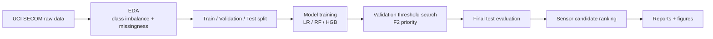

# Semiconductor Manufacturing Fault Detection

> 반도체 제조 공정 센서 데이터 기반 **불량 예측 · 임계값 최적화 · 센서 원인 후보 해석** 프로젝트  
> Manufacturing AI / FDC / Yield Engineering / Process Monitoring Portfolio


---

## At A Glance

| Item | Summary |
|---|---|
| Dataset | UCI SECOM semiconductor manufacturing sensor data |
| Task | Pass/Fail prediction from 590 anonymized process sensor variables |
| Problem Type | Imbalanced binary classification + fault detection thresholding |
| Best Model | RandomForest with validation-based threshold optimization |
| Key Metric | Fail Recall / F2 / PR-AUC, not plain Accuracy |
| Best Test Result | Fail Recall **0.7619**, Fail F2 **0.4301** |
| Main Output | Model comparison, threshold trade-off, confusion matrix, top sensor candidates |


---

## Why I Built This

반도체 제조 데이터는 일반적인 예제 데이터처럼 깨끗하지 않습니다. 센서 결측치가 많고, 불량 샘플은 정상 샘플에 비해 매우 적습니다. 이런 상황에서 Accuracy만 보면 모델이 대부분을 정상으로 예측해도 좋아 보일 수 있습니다.

이 프로젝트는 그 문제를 피하기 위해 아래 흐름으로 진행했습니다.

1. 공정 센서 데이터의 결측/불균형 구조를 먼저 확인한다.
2. 모델을 여러 개 비교하되, Accuracy보다 불량 미탐을 줄이는 Recall/F2를 본다.
3. 임계값은 test set이 아니라 validation set에서 먼저 결정한다.
4. 최종 test set에서 성능을 확인한다.
5. feature importance로 주요 센서 후보를 정리한다.

이 접근은 특정 회사 한 곳이 아니라, **삼성전자 DS, SK하이닉스, 반도체 장비사, 스마트팩토리/제조AI 직무**에서 공통으로 요구되는 데이터 기반 문제해결 흐름을 보여주기 위한 것입니다.

---

## Tech Stack

| Layer | Tools |
|---|---|
| Language | Python |
| Data | pandas, NumPy |
| ML | scikit-learn, Logistic Regression, RandomForest, HistGradientBoosting |
| Evaluation | Precision, Recall, F1, F2, PR-AUC, confusion matrix |
| Visualization | matplotlib |
| Reproducibility | raw-data downloader, deterministic split, generated reports |

---

## Semiconductor Manufacturing Context

이 프로젝트는 익명화된 SECOM 센서 데이터를 사용하므로 특정 공정명을 직접 매핑할 수는 없습니다. 대신 반도체 전공정에서 자주 언급되는 5개 공정 관점으로, 센서 데이터가 어떤 문제와 연결되는지 정리했습니다.

| Process | What Happens | Data / AI View |
|---|---|---|
| Photo | 회로 패턴을 웨이퍼에 전사 | CD, overlay, 노광 조건, 패턴 불량 |
| Etch | 불필요한 막을 제거해 패턴 형성 | 식각률, 균일도, endpoint, chamber 상태 |
| Diffusion | 이온주입/열처리로 전기적 특성 형성 | 온도, 시간, 농도, recipe 안정성 |
| Thin Film | CVD/PVD/ALD로 박막 형성 | 막 두께, 균일도, gas/pressure |
| CMP/Cleaning | 평탄화 및 오염 제거 | particle, scratch, slurry, 세정 조건 |

핵심은 공정명을 외우는 것이 아니라, **공정 조건 - 센서 신호 - 품질/수율 결과**를 데이터 문제로 바꾸는 것입니다.

---

## Dataset

| Property | Value |
|---|---:|
| Samples | 1,567 |
| Sensor Features | 590 |
| Pass Samples | 1,463 |
| Fail Samples | 104 |
| Fail Ratio | 6.64% |

Raw data is not committed. It is downloaded reproducibly through `src/fetch_data.py`.


---

## Pipeline



### Evaluation Design

The decision threshold is selected on the **validation set** using F2 score, then evaluated once on the **test set**. This avoids selecting the threshold directly on the test set.

Why F2?

- In manufacturing fault detection, missed failures can be more expensive than extra inspection.
- F2 gives more weight to Recall than Precision.
- This fits early-warning systems such as FDC, equipment monitoring, and yield risk screening.

---

## Results

| Model | Threshold | Fail Recall | Fail Precision | Fail F1 | Fail F2 | PR-AUC |
|---|---:|---:|---:|---:|---:|---:|
| RandomForest | 0.08 | **0.7619** | 0.1569 | 0.2602 | **0.4301** | **0.2150** |
| Logistic Regression | 0.62 | 0.1905 | 0.1290 | 0.1538 | 0.1739 | 0.1219 |
| HistGradientBoosting | 0.02 | 0.0952 | 0.2222 | 0.1333 | 0.1075 | 0.2137 |

### Confusion Matrix

| | Pred Pass | Pred Fail |
|---|---:|---:|
| True Pass | 207 | 86 |
| True Fail | 5 | 16 |

Interpretation:

- The selected threshold intentionally increases false alarms to reduce missed failures.
- This is reasonable for an early-warning manufacturing use case where missed failures are more costly than extra inspection.
- This model is not claimed as production-ready. The value is in the full problem-solving flow: imbalance recognition, threshold design, metric selection, and sensor candidate ranking.


---

## Sensor Candidate Interpretation

Top sensor candidates from the best model:

| Rank | Sensor | Importance |
|---:|---|---:|
| 1 | sensor_103 | 0.015516 |
| 2 | sensor_059 | 0.015463 |
| 3 | sensor_477 | 0.009988 |
| 4 | sensor_180 | 0.009166 |
| 5 | sensor_129 | 0.008894 |
| 6 | sensor_205 | 0.007902 |
| 7 | sensor_341 | 0.007729 |
| 8 | sensor_039 | 0.007254 |
| 9 | sensor_130 | 0.007154 |
| 10 | sensor_125 | 0.007047 |


Because SECOM anonymizes sensors, the interpretation is framed as **sensor candidate prioritization** rather than direct physical root-cause naming. In a real fab environment, these candidates would be mapped back to process/equipment tags for process or equipment engineer review.

---

## How To Run

```bash
python -m venv .venv
source .venv/bin/activate
pip install -r requirements.txt

python src/fetch_data.py
python src/train.py
```

Generated outputs:

- `reports/metrics.csv`
- `reports/run_summary.md`
- `reports/class_profile.csv`
- `reports/missing_profile.csv`
- `reports/threshold_curve_best.csv`
- `reports/top_features.csv`
- `reports/figures/*.png`

---

## Repository Structure

```text
.
├── README.md
├── LICENSE
├── requirements.txt
├── src
│   ├── fetch_data.py
│   └── train.py
└── reports
    ├── metrics.csv
    ├── run_summary.md
    ├── top_features.csv
    ├── threshold_curve_best.csv
    └── figures
        ├── result_dashboard.png
        ├── class_imbalance.png
        ├── missingness_distribution.png
        ├── precision_recall_curve.png
        ├── threshold_tradeoff.png
        ├── confusion_matrix_best.png
        └── feature_importance.png
```

---

## What This Demonstrates

| Capability | Evidence |
|---|---|
| Manufacturing data understanding | imbalance, missingness, sensor-candidate framing |
| ML modeling | multiple baseline models and fair comparison |
| Metric judgment | Recall/F2/PR-AUC over plain Accuracy |
| Evaluation hygiene | validation threshold selection, final test evaluation |
| Engineer-facing interpretation | top sensor candidates and confusion-matrix trade-off |
| Reproducibility | raw data download script and generated reports |

---

## Interview Summary

반도체 제조 데이터는 결측과 불균형이 큰 데이터라고 보고, 정상/불량 정확도보다 불량 미탐을 줄이는 Recall, F2, PR-AUC를 중심으로 평가했습니다. 임계값은 validation set에서 F2 기준으로 결정하고, test set에서 최종 성능을 확인했습니다. 주요 센서 후보는 feature importance로 정리해 FDC, 설비 이상탐지, 수율 개선 관점으로 확장할 수 있게 분석했습니다.

---

## Next Improvements

- Add SHAP-based local/global explanations
- Add cost-sensitive thresholding with assumed inspection/failure cost
- Add anomaly detection baseline such as Isolation Forest or AutoEncoder
- Add process-tag mapping if a non-anonymized fab dataset is available
- Build a small FastAPI inference endpoint for FDC PoC

